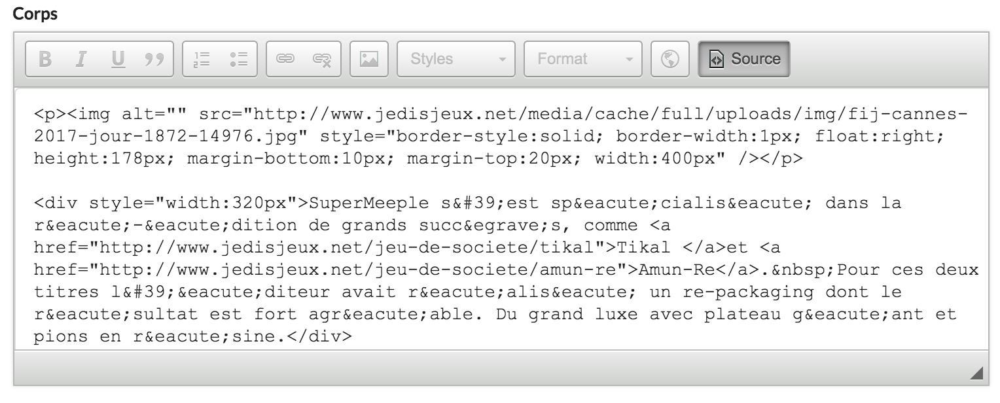

Blocs
=====

Intégrer un contenu dynamique
-----------------------------

On peut intégrer un contenu dynamique de différents types tels qu'un jeu. Pour commencer, passer en mode source dans l'éditeur.

Intégrer un jeu
~~~~~~~~~~~~~~~

.. code-block:: html

   
{game-code}

Remplacer ``{game-code}`` par le code du jeu que vous pouvez trouver dans la liste des jeux.