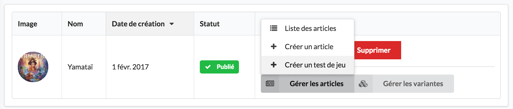
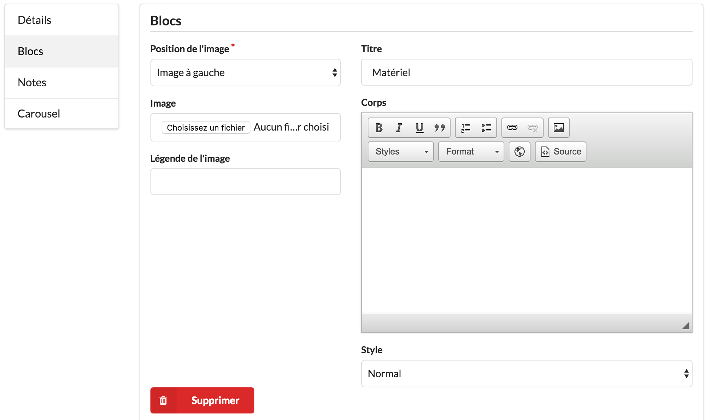

Test de jeu
===========

Pour rédiger un test de jeu, il faut partir de la liste des jeux, suivre le bouton "Gérer les articles" et enfin suivre "Créer un test de jeu".

Ainsi, l'article sera bien relié au jeu correspondant et les paragraphes génériques seront créés.

