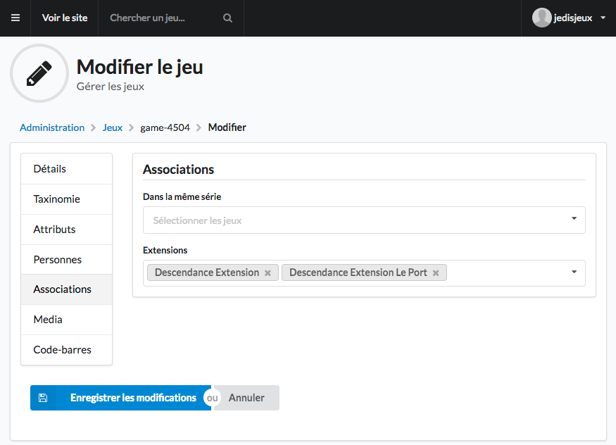

Extension
=========

Les extensions de jeu sont un jeu à part entière (comme les jeux de la même série). Une extension se crée comme un jeu classique.

Pour la liaison, il faut partir du jeu de base et ajouter le-s extension-s via l’onglet “Associations” en modification du jeu (le formulaire).

