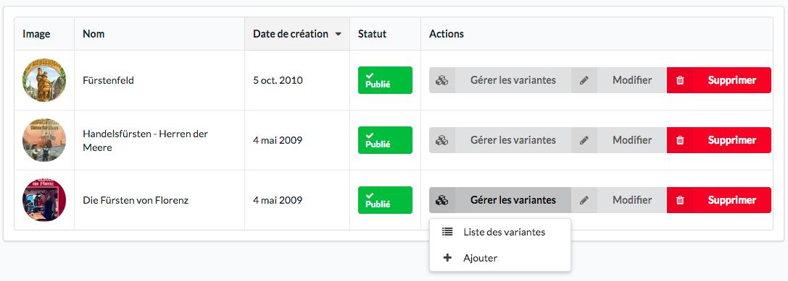

Ré-édition
==========

La ré-édition est lorsque le jeu ressort dans une nouvelle édition.
Cela est géré à l’aide des variantes de produit. Vous pouvez y accéder via “Gérer les variantes” dans la liste des jeux du back office.

Il ne faut pas c~réer un nouveau jeu, mais créer un nouveau variant.

