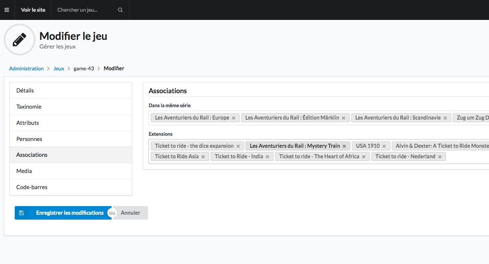

De la même série
================

Certains jeux ne sont pas des ré-éditions mais ont un lien entre-eux comme les différents aventuriers du rail par exemple. Un jeu de la même série se crée comme un jeu classique contrairement aux ré-éditions.

Pour la liaison avec les autres jeux de la même série, cela se gère via les associations. Vous pouvez y accéder via l’onglet “Associations” en modification du jeu (dans le formulaire).

